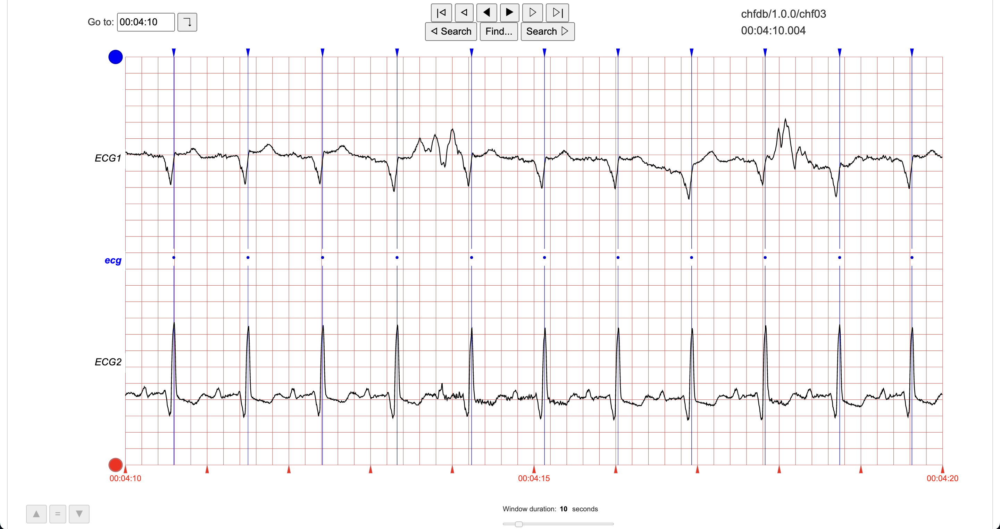

# Waveform Database

## About

Waveform Database (WFDB) is a set of file standards designed for reading and storing physiologic signal data, and associated annotations. See the [WFDB Spec](https://github.com/wfdb/wfdb-spec/) repository for the specification details.

Example signal types include [ECG](https://en.wikipedia.org/wiki/Electrocardiography) and [EEG](https://en.wikipedia.org/wiki/Electroencephalography). Example annotation types include automated machine-labelled heart-beats, and clinician comments regarding specific signal artifacts.

There are several available [software packages](#software-packages) that implement the WFDB specifications. Consider using one of them if you want to conduct research or build algorithms using physiologic data.

## History

The original WFDB Software Package, written in C, along with a set of new file specifications, was created by George B. Moody in 1989.

While working at the [Lab for Computational Physiology](https://lcp.mit.edu/) (LCP) in the Harvard-MIT Division of Health Sciences and Technology, George also created [PhysioNet](http://physionet.org), a platform that hosts many WFDB-related databases, software packages, and resources.

As the preferred programming tools of the scientific industry evolved over time, members of the LCP created more [WFDB software packages](#software-packages) to faciliate more effective research and usage.

## Software Packages

The WFDB specification is openly-licensed, so anyone can implement and modify software according to the spec. Here are the main packages and implementations that we officially recognize:

- [WFDB Software Package](https://github.com/bemoody/wfdb) - The original software package written in C. Contains the core library, command line tools, and WAVE. See also the [PhysioNet publication](https://physionet.org/content/wfdb/). Associated documents:
  - [WFDB Programmer's Guide](https://physionet.org/physiotools/wpg/) - Guide to programming with the WFDB C library.
  - [WFDB Applications Guide](https://physionet.org/physiotools/wag/wag.htm) - Guide to using the WFDB C compiled command line tools.
- [WFDB Python Package](https://github.com/MIT-LCP/wfdb-python/) - A native Python implementation of WFDB. See also the [PhysioNet publication](https://physionet.org/content/wfdb-python/).
- [WFDB Toolbox for Matlab](https://github.com/ikarosilva/wfdb-app-toolbox) - A set of Java, GUI, and m-code wrapper functions, which make system calls to WFDB Software Package and other applications.
- [LightWAVE](https://github.com/bemoody/lightwave) - A lightweight web-based waveform and annotation viewer and editor. Available for use at <http://physionet.org/lightwave>

There are also many WFDB-related software toolkits for analyzing waveform data hosted on <http://physionet.org>.

## Why to Use WFDB

### Availability of Data

There is a LOT of waveform data in WFDB format on <http://physionet.org>: tens of terrabytes, and growing. For this reason, WFDB is already very widely used.

Notable examples include:

- [The MIT-BIH Arrhythmia Database](https://physionet.org/content/mitdb/)
- [The MIMIC-III Waveform Database](https://physionet.org/content/mimic3wdb/1.0/), which is 6.7TB, and its [Matched Subset](https://physionet.org/content/mimic3wdb-matched/1.0/).

### Standards and Software

Trying to store many hours or days of multi-channel signals recorded at 100+ Hz in text formats such as CSV, is highly suboptimal, both for cost, and performance (even with 2022 levels of storage and compute). WFDB contains several binary formats for effective storage, data streaming, and direct/random access. In addition, the WFDB software provides many utilities for visualizing and analyzing the data, such as ECG peak detectors.

Signal file formats for physiologic waveforms are currently very scattered, and oftenly proprietary, closed-sourced, and application specific for their owning institutions. WFDB will always be open-source and continually developed for the benefit of the wider community. Its usage is not tied to any proprietary or paid software packages, platforms, or vendors.

PS: If you know of a better format for physiologic wavforms, [tell us](#questions-and-contact).

## About Us

WFDB is under active development! A working group, composed of MIT-LCP members and external collaborators, has been formed to coordinate efforts in making WFDB more useful, popular, and accessible.

Methods include designing better APIS, improving performance, improving documentation, adding new file formats, adding support for more languages, and more.

We strongly encourage the open community to contribute to the software, documentation, and [discussions](https://github.com/wfdb/wfdb-spec/discussions).

## Questions and Contact

For questions, comments, and suggestions about WFDB, and where efforts are being directed, please use the WFDB-Spec repo's [discussions page](https://github.com/wfdb/wfdb-spec/discussions). Tell us what you like, dislike, and how we can make WFDB better for you.

To receive announcements about WFDB, join the announcements [email list](https://groups.google.com/g/wfdb-users/).
