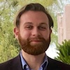

# WFDB Working Group

The WFDB project is maintained by the following contributors:

| Photo | Name | Affiliation |
|:-----:|:----:|:-----------:|
|  | Brian Gow (Chair) | MIT |
|  | Alasdair Gent | Duke University |
|  | Ted Habermann | Metadata Game Changers |
|  | Eric Helfenbein | Philips Healthcare |
|  | Manlik Kwong | Tufts University School of Medicine |
|  | Benjamin Moody | MIT |
|  | Tom Pollard | MIT |

The WFDB project does not currently have dedicated funding. It is supported as part of broader efforts in open biomedical data sharing and physiological signal processing.

Interested in joining the group? [Contact us on GitHub](https://github.com/wfdb/wfdb.github.io)
